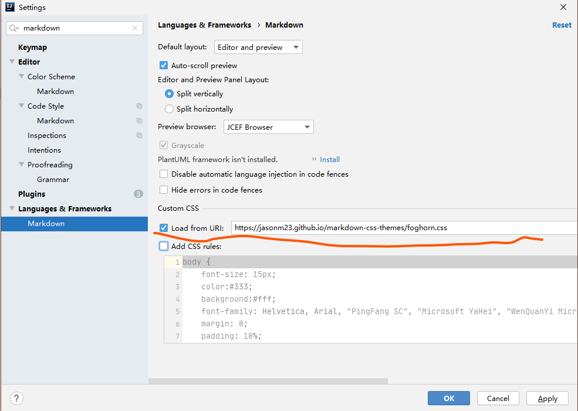
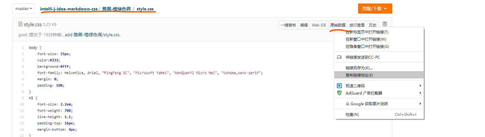

# IntelliJ-IDEA-markdown-css

#### 介绍
IntelliJ IDEA 中markdown 语法的css 样式 

#### 软件架构
- [雅黑-橙绿色调](https://gitee.com/pocg/intelli-j-idea-markdown-css/tree/master/%E9%9B%85%E9%BB%91-%E6%A9%99%E7%BB%BF%E8%89%B2%E8%B0%83)
- ...

#### 使用说明

1.  idea 中安装 markdown 插件
2.  打开设置(File - setting) ,搜索markdown

3.  把项目中对应的css路径-右键原始数据-复制链接,然后到上面的url中粘贴即可

#### 参与贡献

1.  欢迎各路css设计大神Fork 本仓库
2.  新建 Feat_xxx 分支
3.  提交代码(注意按照不同风格新建名字目录,目录下包含:style.css,demo.png,README.md 三个文件,其中内容演示的效果截图)
4.  新建 Pull Request

